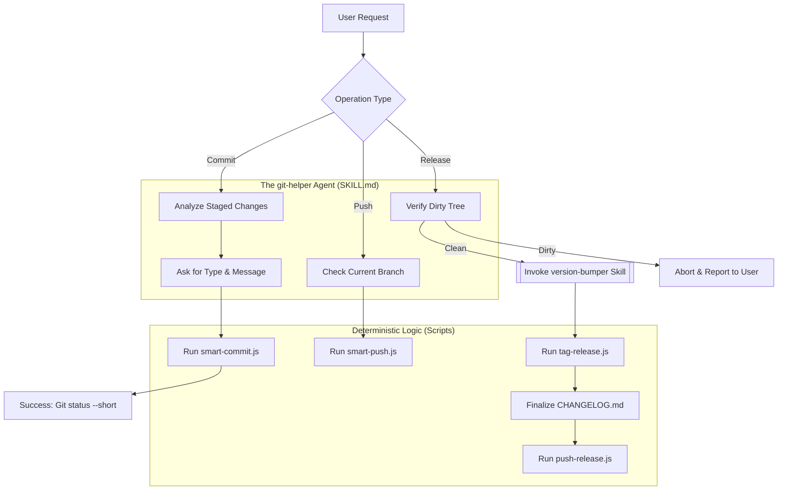

# Git-Helper Skill: Workflow & Educational Analysis

This document provides a visual and conceptual breakdown of the `git-helper` skill, illustrating how it manages the standard development lifecycle and integrates with other modular "micro-skills."

## 📊 Skill Workflow Diagram

The following Mermaid diagram maps the decision-making and execution flow of the `git-helper` agent during common operations.

---

## 📖 Educational Take-Aways

### 1. **Separation of Concerns: Agent vs. Script**
The `git-helper` skill demonstrates a crucial design pattern: the **Agent** handles ambiguity (asking for a commit message, analyzing context), while the **Scripts** handle deterministic execution (formatting strings, calling shell commands). 

*   **Take-away**: Use the `SKILL.md` for high-level reasoning and the `scripts/` directory for code that must behave identically every time.

### 2. **Skill Chaining (Orchestration)**
Observe the "Release" flow in the diagram. `git-helper` doesn't just bump versions; it waits for the `version-bumper` skill to complete before finalizing the tag.

*   **Take-away**: Skills should be modular "micro-services." One skill handles the version math, while another handles the git plumbing. This makes the system easier to test and reuse.

### 3. **The "Clean Tree" Safety Gate**
The skill prioritizes safety by checking for a "Dirty Tree" before initiating a release. This prevents uncommitted local changes from accidentally being bundled into a production release.

*   **Take-away**: Always include "pre-flight checks" in your skills when performing destructive or high-impact operations like pushing or tagging.

### 4. **Standardization via Convention**
By forcing a `type` (feat, fix, docs, etc.) during the commit process, the skill enforces **Conventional Commits**. This standardization makes it possible to automate the generation of `CHANGELOG.md` later in the pipeline.

*   **Take-away**: Use skills to enforce team standards (linting, naming, formatting) at the source, rather than fixing them after the fact.

---

## 🛠️ Improvement Plan (Importance Hierarchy)

This hierarchy ranks potential enhancements from "Critical Safety/Functionality" to "Convenience/Experience."

### **1. High Priority (Safety & Reliability)**
*   **Fix: Error Handling in `smart-push.js`**: Ensure the script handles network failures or remote rejected pushes gracefully, providing clear feedback to the agent.
*   **Add: Pre-Commit Hook Integration**: Automatically run linters or tests via `smart-commit.js` before finalizing the commit to ensure code quality.
*   **Fix: Tag Collisions**: Add a check in `tag-release.js` to verify if a tag already exists on the remote before attempting to create it locally.

### **2. Medium Priority (Feature Expansion)**
*   **Add: Branch Creation & Management**: Implement `smart-branch.js` to create feature branches following a specific naming convention (e.g., `feat/TICKET-ID-description`).
*   **Add: Multi-Remote Support**: Allow `smart-push.js` to handle multiple remotes or upstream tracking configuration more dynamically.
*   **Improve: Semantic Analysis of Changes**: Enhance the agent's ability to suggest the commit `type` by actually reading the diff of staged files.

### **3. Low Priority (Developer Experience)**
*   **Add: Interactive Rebase Helper**: A script to help clean up local commit history before pushing.
*   **Improve: Detailed `CHANGELOG` formatting**: Support more granular categorization (e.g., "Breaking Changes," "Dependency Updates") in `tag-release.js`.
*   **Add: Dry-Run Mode**: Allow users to see what git commands *would* be run without actually executing them.
