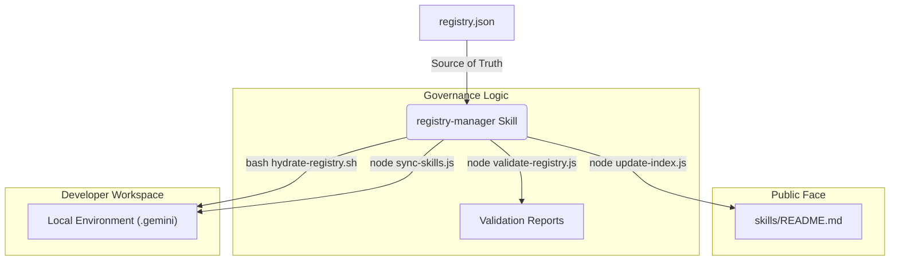

# Skill Registry Architecture

This document outlines the centralized governance model for the Team Skill Platform. All skills are now managed via a **Single Source of Truth** (`registry.json`) and a dedicated **Registry-Manager** skill.

## 📊 Governance Workflow

The following Mermaid diagram illustrates how the `registry-manager` skill maintains the ecosystem's integrity.

---

## 📖 Key Components

### 1. The Manifest (`registry.json`)
The manifest holds metadata for every official skill. By updating this file, platform architects can:
- **Deploy** new skills by adding their paths.
- **Roll out** updates by incrementing version numbers.
- **Deprecate** obsolete skills by changing their status.

### 2. The Registry-Manager Skill
Located in `skills/registry-manager/`, this skill encapsulates all tools needed to manage the manifest and the developer workspace.

---

## 💬 Prompt Examples for Registry Operations

Use these example prompts when interacting with the **Registry-Manager** agent:

### **Scenario: Onboarding a New Developer**
> **User**: "I'm new to the project. Please initialize my workspace with all the official team skills."
> **Agent**: "Welcome! I will now run `hydrate-registry.sh` to bulk-link all 14 skills from the repository to your local environment. One moment..."

### **Scenario: Deploying a New Skill Version**
> **User**: "I've updated `git-helper` to v1.4.0. Please audit the registry and update the public index."
> **Agent**: "Auditing registry... `v1.4.0` confirmed. Running `update-index.js` to refresh the skills README. Done! Your changes are now indexed for the team."

### **Scenario: Handling Deprecation**
> **User**: "Why am I getting a warning for `old-auth-skill`?"
> **Agent**: "The `old-auth-skill` was marked as **deprecated** in the latest registry update. The team has moved to `auth-pro` for better security. Would you like me to help you migrate your scripts to the new skill?"

### **Scenario: General Health Check**
> **User**: "Perform a full registry audit."
> **Agent**: "I will now validate the manifest structure and then synchronize your local environment. [Running validate-registry.js... node sync-skills.js...] Everything looks correct! Your workspace is fully synchronized."
